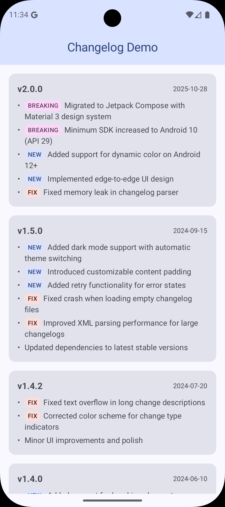

# changelog-compose

A Jetpack Compose library for displaying changelogs in Android applications. This library parses XML-formatted changelog files and presents them with a clean, Material 3 UI.



## Features

- **Jetpack Compose UI**: Modern declarative UI built with Compose and Material 3
- **XML Parser**: Reads changelog from XML files in your `res/raw` resources
- **Change Types**: Support for categorized changes (FIX, NEW, BREAKING)
- **Built-in States**: Automatic handling of loading and error states with retry
- **Customizable**: Configurable padding and labels
- **Version Grouping**: Organizes changes by release version with optional dates

## Requirements

- **Min SDK**: 24 (Android 7.0)
- **Kotlin**: 2.0.21+
- **Jetpack Compose**: UI 1.9.4+, Material3 1.4.0+

## Installation

Add the dependency to your app's `build.gradle.kts`:

```kotlin
dependencies {
    implementation("com.codingfeline.changelog:changelog-compose:0.2.0")
}
```

Or using version catalog in `gradle/libs.versions.toml`:

```toml
[versions]
changelog-compose = "0.2.0"

[libraries]
changelog-compose = { module = "com.codingfeline.changelog:changelog-compose", version.ref = "changelog-compose" }
```

Then in your `build.gradle.kts`:

```kotlin
dependencies {
    implementation(libs.changelog.compose)
}
```

## Usage

### 1. Create a Changelog XML File

Create an XML file in `app/src/main/res/raw/` (e.g., `changelog.xml`):

```xml
<?xml version="1.0" encoding="utf-8"?>
<changelog>
    <changelogversion versionName="1.1.0" changeDate="2024-10-28">
        <changelogtext type="new">Added dark mode support</changelogtext>
        <changelogtext type="new">Added settings screen</changelogtext>
        <changelogtext type="fix">Fixed crash on startup</changelogtext>
    </changelogversion>

    <changelogversion versionName="1.0.0" changeDate="2024-10-01">
        <changelogtext>Initial release</changelogtext>
        <changelogtext type="new">User authentication</changelogtext>
        <changelogtext type="new">Main dashboard</changelogtext>
    </changelogversion>
</changelog>
```

### 2. Add the Composable

Use the `ChangelogContent` composable in your app:

```kotlin
import com.codingfeline.changelog.ChangelogContent
import androidx.compose.runtime.Composable
import androidx.compose.ui.Modifier

@Composable
fun ChangelogScreen() {
    ChangelogContent(
        changelogResId = R.raw.changelog,
        modifier = Modifier.fillMaxSize()
    )
}
```

The composable automatically handles:
- **Loading state**: Shows a loading indicator while parsing the XML
- **Error state**: Displays error message with retry button
- **Success state**: Presents the changelog in a scrollable list

## XML Format

### Root Element

```xml
<changelog>
    <!-- Release versions go here -->
</changelog>
```

### Version Element

```xml
<changelogversion
    versionName="1.0.0"    <!-- Required: Version number -->
    changeDate="2024-10-28"> <!-- Optional: Release date -->
    <!-- Changes go here -->
</changelogversion>
```

### Change Text Element

```xml
<changelogtext type="new">
    Description of the change
</changelogtext>
```

#### Supported Types

- `type="new"` - New features (default styling)
- `type="fix"` - Bug fixes
- `type="breaking"` - Breaking changes
- No type attribute - General changes

## Architecture

The library consists of:

- **ChangelogContent**: Main composable API
- **ChangelogParser**: XML parser that reads from raw resources
- **ChangelogViewModel**: Manages loading state and error handling
- **Data Models**: `Changelog`, `Release`, `ChangeItem`, `ChangeType`
- **Internal UI**: Composables for loading, error, and list display

## Dependencies

The library uses:

- Jetpack Compose (Material 3)
- Lifecycle ViewModel Compose
- Kotlin Coroutines
- AndroidX Core KTX

## Sample App

The `app` module demonstrates how to integrate the changelog library in your application.

## License

```
Copyright 2025 Yasuhiro Shimizu

Licensed under the Apache License, Version 2.0 (the "License");
you may not use this file except in compliance with the License.
You may obtain a copy of the License at

    http://www.apache.org/licenses/LICENSE-2.0

Unless required by applicable law or agreed to in writing, software
distributed under the License is distributed on an "AS IS" BASIS,
WITHOUT WARRANTIES OR CONDITIONS OF ANY KIND, either express or implied.
See the License for the specific language governing permissions and
limitations under the License.
```

## Contributing

Contributions are welcome! Please feel free to submit a Pull Request.

